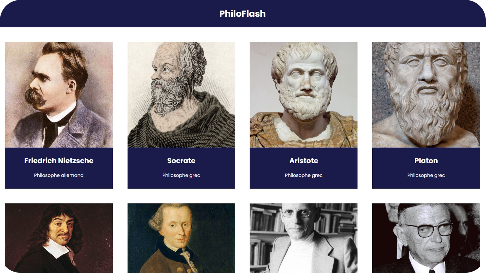

<h1 align="center">React Philosopher Wiki</h1>
<p align="center">
	
</p>
<p align="center">A responsive and customizable React-based web app featuring concise biographies of famous philosophers.</p>
<p align="center">Easily update and expand content using a JSON data file.</p>

# Install
```bash
  npm install
  npm run dev
```

# Credits

* [**Quentin PETIT**](https://github.com/quentinptt) : Creator of the project.
